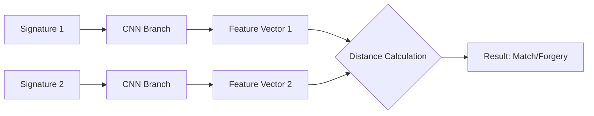

<div align="center">

# 🖋️ Sign-Verify
### Deep Learning Powered Signature Verification System

[](https://www.python.org/)
[](https://flask.palletsprojects.com/)
[](https://pytorch.org/)
[](https://opensource.org/licenses/MIT)

---

<p align="center">
  <b>A state-of-the-art signature verification system utilizing Siamese Neural Networks to detect forgeries with high precision.</b>
</p>

[Explore Docs]() · [Report Bug]() · [Request Feature]()

</div>

---

## 📽️ Project Overview
**Sign-Verify** is an end-to-end machine learning project designed to authenticate handwritten signatures. By leveraging the power of **Siamese Neural Networks**, the system compares a "query" signature against a "reference" signature and calculates the similarity distance.

If the distance is below a learned threshold, the signatures are marked as a **MATCH** (Genuine); otherwise, they are flagged as a **DO NOT MATCH** (Potential Forgery).

### ✨ Key Features
- 🚀 **Siamese Network Architecture**: High-accuracy comparison model trained on signature pairs.
- 🖼️ **Real-time Verification**: Upload any two signature images and get instant results.
- 📊 **Similarity Scoring**: Provides a numerical confidence score (Euclidean distance).
- 📱 **Responsive Web Interface**: Modern, clean UI built with Flask and Vanilla CSS.
- ⚡ **Optimized Preprocessing**: Automatic grayscale conversion and resizing for consistent results.

---

## 🛠️ Tech Stack
| Category | Technology |
| :--- | :--- |
| **Backend** |  |
| **Deep Learning** |  |
| **Computer Vision** |  |
| **Frontend** |   |

---

## 🧠 Architecture
The core of this project is a **Siamese Network**, a class of neural network architectures that contain two or more identical subnetworks.

- **Feature Extraction**: Two identical CNN branches extract high-dimensional feature vectors from input signatures.
- **Distance Metric**: The system calculates the **Euclidean Distance** between these vectors.
- **Matching Logic**: 
  - `Distance < Threshold` → **Genuine Match**
  - `Distance > Threshold` → **Forgery Detected**



---

## 🚀 Getting Started

### Prerequisites
- Python 3.8+
- GPU (Optional but recommended for training)

### Installation
1. **Clone the repository**:
   ```bash
   git clone https://github.com/yourusername/Sign-verify.git
   cd Sign-verify
   ```

2. **Install dependencies**:
   ```bash
   pip install -r requirements.txt
   ```

3. **Download/Setup the Model**:
   Ensure you have the trained model checkpoint at `checkpoints/siamese_best.pth`.

### Running the App
```bash
python webapp.py
```
Open your browser and navigate to `http://127.0.0.1:5000`.

---

## 📂 Project Structure
```text
Sign-verify/
├── checkpoints/           # Saved model weights (.pth)
├── signatures_dataset/    # Dataset for training/validation
├── templates/             # HTML templates for the UI
├── uploads/               # Temporary storage for uploaded images
├── webapp.py              # Flask server entry point
├── train.ipynb            # Model training & experimentation
└── requirements.txt       # Project dependencies
```

---

## 📈 Future Roadmap
- [ ] Support for **Triple Loss** function for better accuracy.
- [ ] Integration with a production-grade database (PostgreSQL).
- [ ] Mobile app support for on-the-go verification.
- [ ] API documentation for third-party integrations.

---

<div align="center">
  <b>Developed with ❤️ for Secure Document Verification.</b>
</div>
